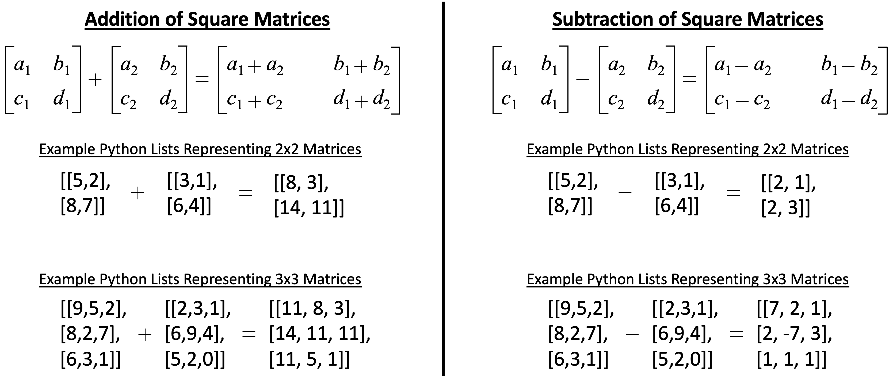

# Exam 3 (Final Exam)

## Rules of Behavior
1. Do not communicate with anyone during the exam (no email, no social media, no Discord, no texting, no phones, no talking, no passing notes, no internet communicating).  If there is any evidence of communicating with anyone during the exam you will receive a zero.
1. You **must** turn off your cell phone and store it away.
1. Your submission **must** be solely you own work without the assistance of anyone by any means.
1. All programming code **must** be written in Python.
1. You **must** use Tuffix to unit test your program.
1. All your code **must** be pushed to Github by the scheduled end of class today.  Any submissions after that time will not be considered.
1. You may use your book.
1. You may use the Internet as a **reference only**.
1. If you have questions, approach the instructor desk.

## Getting Started
1. Open the Terminal program in Tuffix.
1. Change the present working directory to the `Documents` directory by typing the following command at the command prompt:

    ```
    cd Documents
    ```

1. Make a copy of this Github repository on your computer using the `git` and `clone` commands that you will input to the terminal. The commands take a URL as a parameter to specify where it can get a copy of the repository. You can find the URL by clicking on the green *Clone or download* button at the top right part of this page. Copy the URL and replace the example text shown below. Note that `username` should be replaced with your own Github username. When you hit <kbd>Enter</kbd> it will ask you to provide your Github username and token. Once done, you will have a copy of the repository on your computer.
    ```
    git clone https://github.com/CSUF-CPSC223P-STMAY-2023F/exam03-username.git
    ```
1. Navigate into the new directory using the command line. Note that `username` should be replaced with your own Github username.  As a shortcut, you can type the first few letters of the folder name and press <kbd>Tab</kbd> so that it auto completes the folder name for you.

     ```
     cd exam03-username
     ```

## Program Instructions
1. Write a Python class that adds and subtracts matrices of any size.

<p align="center">
  
</p>

1. Create a `simplematrix` module to meet the following requirements:
     1. Create a file named `simplematrix.py`.
          1. Define a class named `SimppleMatrix`.  
               1. Define a member function named `setA` to meet the following requirements:
                    1. Accept a matrix as a list positional parameter.
                    1. If the list does not represent a square matrix (i.e. 2x2 or 3x3) or any of the elements of the list are not integers, return a False.
                    1. Otherwise store the list for future adds or subtracts and return a True.
               1. Define a member function named `setB` to meet the following requirements:
                    1. Accept a matrix as a list positional parameter.
                    1. If the list does not represent a square matrix (i.e. 2x2 or 3x3) or any of the elements of the list are not integers, return a False.
                    1. Otherwise store the list for future adds or subtracts and return a True.
               1. Define a member function named `addMatrices` to meet the following requirements:
                    1. If the lists stored from setA and setB do not represent the same size matrices then return a False.
                    1. Otherwise create and return a new list that represents the matrix from setA plus the matrix from setB.
               1. Define a member function named `subtractMatrices` to meet the following requirements:
                    1. If the lists stored from setA and setB do not represent the same size matrices then return a False.
                    1. Otherwise create and return a new list that represents the matrix from setA minus the matrix from setB.
1. While the main.py file does not need to be submitted and will not be graded, I strongly suggest you create your own very simple main.py file to create the object instance and make all the function calls with various data, to test the return strings and the dictionary of data.

    ```
    python3 -m main
    ```

1. Run the unit testing program to ensure that your program runs as expected.

    ```
    ./test.sh
    ```

    The unit testing will output the results of a series of tests using specific input and expected output.  Any error will provide information on where the expected output is different from the actual output.  You will need to edit your source code to fix the error and run `./test.sh` repeatedly until it passes all the test.

## Submission
Periodically throughout the exercise, and when you have completed the exercise, **submit the complete repository to Github**.

   <pre>git add .<br>git commit -m "<i>your comment</i>"<br>git push</pre>

In case it asks you  to configure global variables for an email and name, just copy the commands it provides then replace the dummy text with your email and Github token.

   <pre>git config --global user.email "<i>tuffy@csu.fullerton.edu</i>"<br>git config --global user.name "<i>Tuffy Titan</i>"<br>git commit -m "<i>your comment</i>"<br>git push</pre>

When you completed the final Github push, go back into github.com through the browser interface and ensure all your files have been correctly updated.  You should have the following files:
```
simplematrix.py
test.txt
```

## Grading
1. All points add up to a total of 100 points possible as detailed below.  Partial credit will be given where applicable.

| Points | Description |
| --- | --- |
|50|initial git clone of this repository to your Tuffix machine|
|14|simplematrix.py file submitted and meets the program requirements |
|3|unit test passes Test01_SetA_Valid|
|3|unit test passes Test02_SetA_NotSquare|
|3|unit test passes Test03_SetA_NotIntegers|
|3|unit test passes Test04_SetB_Valid|
|3|unit test passes Test05_SetB_NotSquare|
|3|unit test passes Test06_SetB_NotIntegers|
|3|unit test passes Test07_AddMatrices_Valid2x2|
|3|unit test passes Test08_AddMatrices_Valid3x3|
|3|unit test passes Test09_AddMatrices_InvalidNotSameSizes|
|3|unit test passes Test10_SubtractMatrices_Valid2x2|
|3|unit test passes Test11_SubtractMatrices_Valid3x3|
|3|unit test passes Test12_SubtractMatrices_InvalidNotSameSizes|
